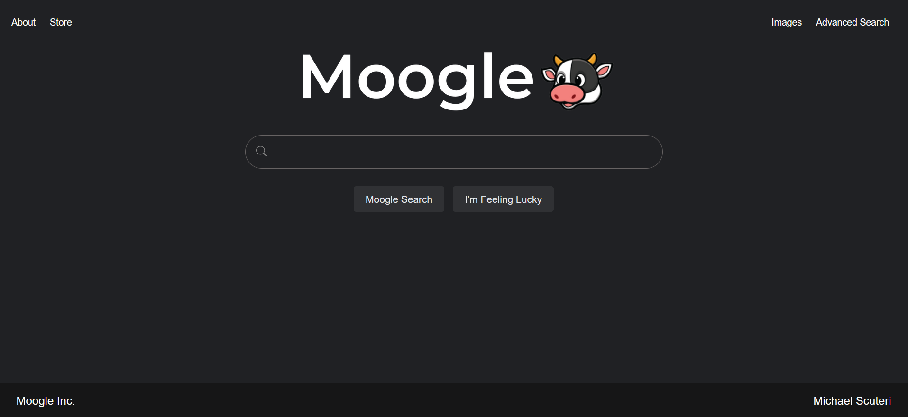
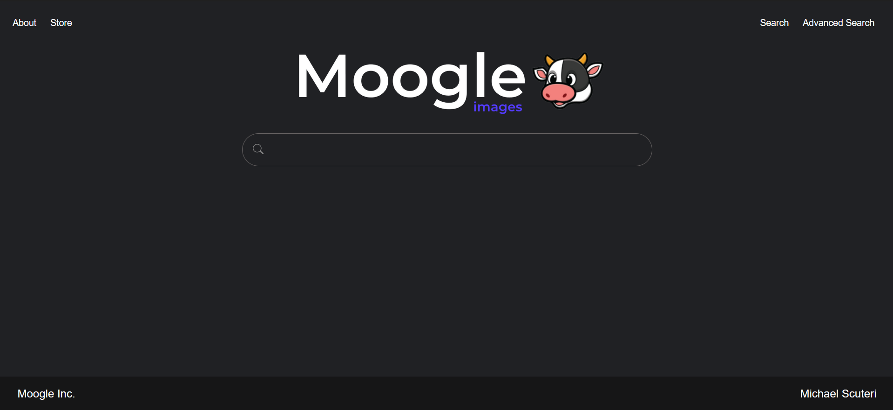
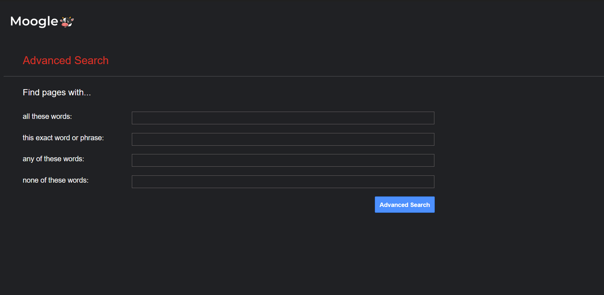

# Moogle Search
Based around Project 0 in CS50's Web Programming Course, the task was to create a clone of the Google search webpage with HTML and CSS. Instead of creating a direct clone i decided to create a slight parody of Google search called Moogle search, a cow themed search engine.

## Functionality
- **Regular Search Page:** Moogle uses Google search engine for both regular and 'Im Feeling Lucky' searches.
- **Image Search Page:** Moogle uses Google image search
- **Advanced Search Page:** Moogle has a Advanced Search page that mimics Google's own with similar functionailty.

## Screenshots

